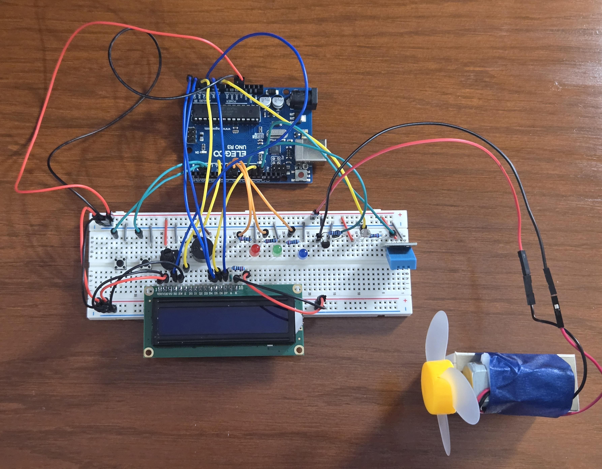
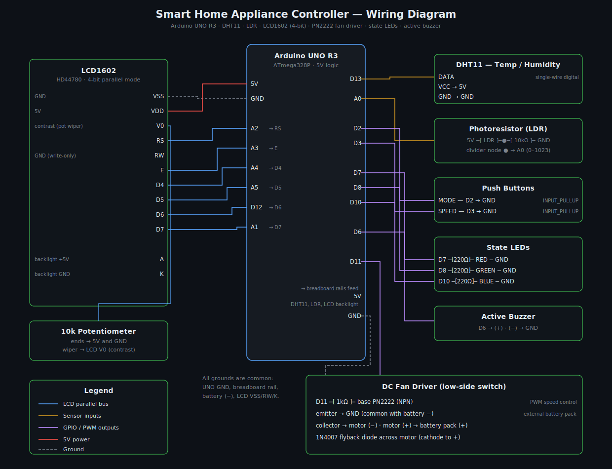
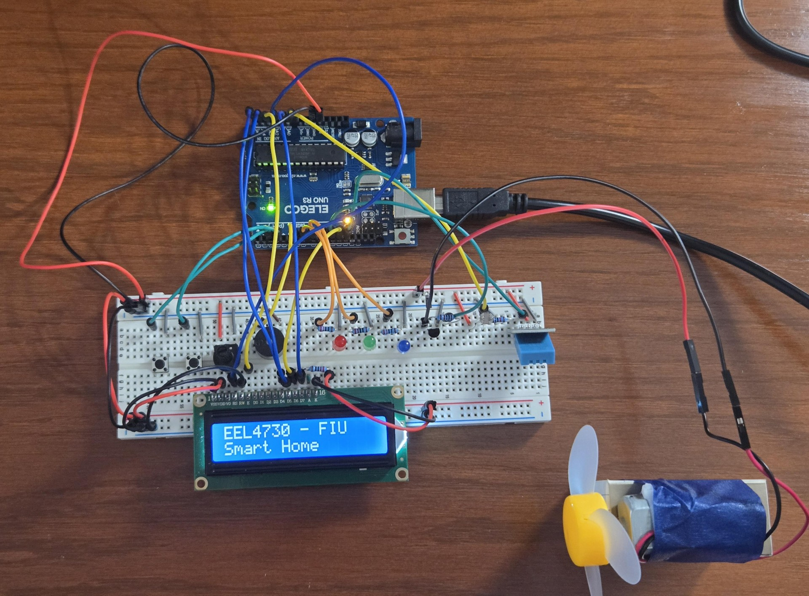
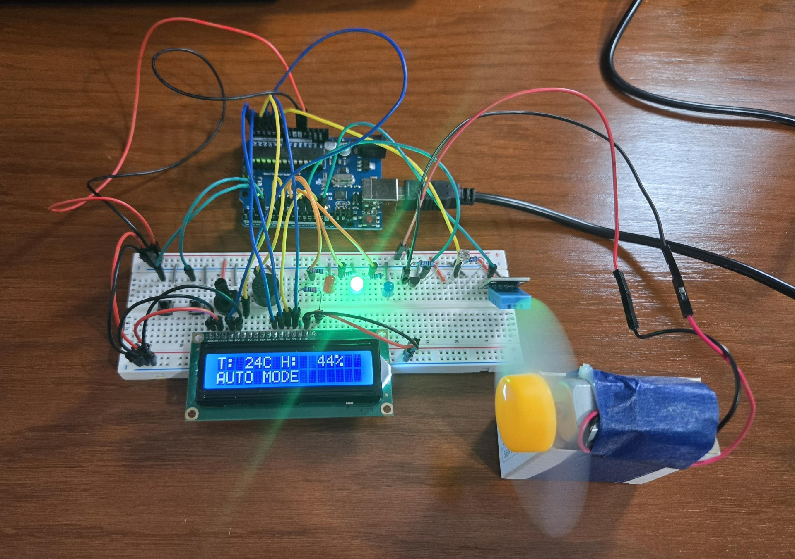
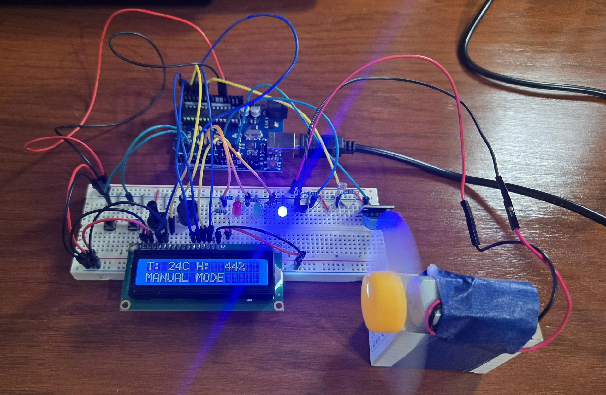
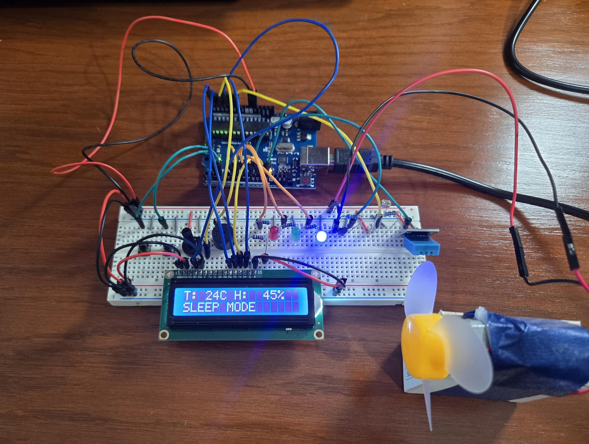
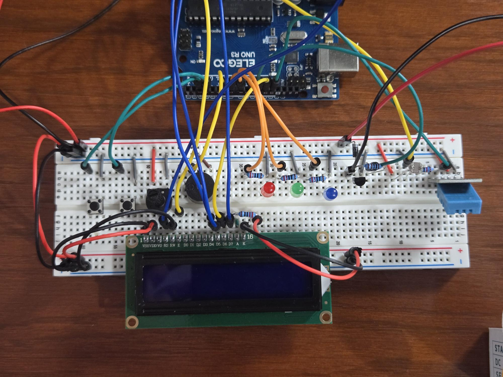
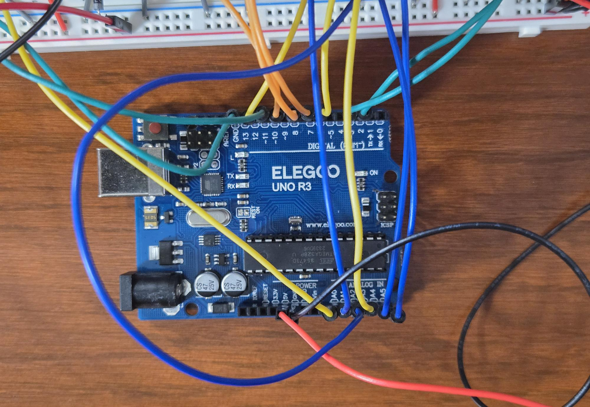

# Smart Home Appliance Controller


An embedded climate controller that automatically manages a DC fan from
real-time temperature, humidity, and ambient light — built on an Arduino
UNO R3 with a four-mode state machine, an LCD status display, and a
hardware safety cutoff.

> Built as a **team project** for EEL 4730 (Programming Embedded Systems) at
> Florida International University. This repository is maintained by
> **Mohamed Elbahlool**, who contributed to the design, coding, and testing
> of the system — see [Credits](#credits--contributors).



## Overview

The controller reads a DHT11 temperature/humidity sensor and a
photoresistor, then drives a small DC fan through a PN2222 transistor with
PWM. A 16x2 LCD shows live readings and the active mode, three LEDs give
at-a-glance state, and an active buzzer plus automatic fan shutdown act as
an over-temperature countermeasure at 35 °C — the same protective pattern
used in real HVAC and appliance controllers. Everything is also logged over
UART at 9600 baud.

The project was built to exercise the core embedded-systems toolkit on real
hardware: ADC sampling, PWM actuation, GPIO with pull-ups and debouncing, a
digital single-wire sensor protocol, UART logging, and a state machine tying
it all together.

## Features

- **AUTO mode** — fan speed follows temperature: LOW below 24 °C, MEDIUM
  from 24 °C, FULL from 28 °C
- **MANUAL mode** — a button cycles the fan OFF → LOW → MEDIUM → FULL
- **SLEEP mode** — fan off; the blue LED becomes an adaptive nightlight
  (darker room → brighter LED, using the LDR reading)
- **ALARM** — at ≥ 35 °C the fan shuts down, the buzzer sounds, and the red
  LED lights until the temperature falls
- **LCD1602 display** — temperature, humidity, and current mode, live
- **Ambient light classification** — Dark / Dim / Light / Bright / Very
  Bright, reported over serial
- **Structured serial logging** — every reading and state change at 9600 baud

## System architecture

```
            ┌────────────────────── Arduino UNO R3 (ATmega328P) ─────────────────────┐
 sensors    │                                                                        │  outputs
 DHT11 ──────▶ single-wire read ──┐                       ┌── PWM (D11) ──▶ PN2222 ──▶ DC fan
 LDR ────────▶ ADC (A0) ──────────┤   state machine       ├── GPIO ───────▶ LEDs (R/G/B)
 buttons ────▶ GPIO + debounce ───┤ AUTO/MANUAL/SLEEP/ALARM├── GPIO ───────▶ buzzer
            │                     └───────────────────────┤── 4-bit bus ──▶ LCD1602
            │                                             └── UART 9600 ──▶ PC serial monitor
            └────────────────────────────────────────────────────────────────────────┘
```

**State machine:** power-on starts in AUTO; the mode button cycles
AUTO → MANUAL → SLEEP; the alarm condition overrides any mode while the
temperature is at or above the threshold.

## Hardware

| Component | Purpose |
|-----------|---------|
| Elegoo UNO R3 (ATmega328P) | main microcontroller |
| DHT11 | temperature + humidity |
| Photoresistor + 10 kΩ divider | ambient light on A0 |
| DC fan motor + battery pack | the controlled appliance |
| PN2222 + 1 kΩ base resistor | low-side fan driver (PWM) |
| 1N4007 | flyback diode across the motor |
| LCD1602 + 10 kΩ contrast pot | live status display (4-bit mode) |
| Red / green / blue LEDs + 220 Ω | mode and alarm indicators |
| Active buzzer | over-temperature alarm |
| 2 push buttons | mode select, manual fan speed |

Full bill of materials and design notes: [docs/hardware.md](docs/hardware.md)

## Pinout

| Pin | Function | | Pin | Function |
|-----|----------|-|-----|----------|
| D2  | Mode button (`INPUT_PULLUP`) | | D12 | LCD D6 |
| D3  | Speed button (`INPUT_PULLUP`) | | D13 | DHT11 data |
| D6  | Active buzzer | | A0 | LDR (ADC) |
| D7  | Red LED | | A1 | LCD D7 |
| D8  | Green LED | | A2 | LCD RS |
| D10 | Blue LED (PWM) | | A3 | LCD E |
| D11 | Fan PWM → PN2222 | | A4/A5 | LCD D4/D5 |

## Schematics

Complete wiring diagram — available as
[SVG](schematics/wiring-diagram.svg) ·
[PNG](schematics/wiring-diagram.png) ·
[PDF](schematics/wiring-diagram.pdf):



## Getting started

**Requirements:** Arduino IDE (or `arduino-cli`), an Arduino UNO-compatible
board, and the hardware above.

1. Clone the repository:
   ```bash
   git clone https://github.com/lla7wel/smart-home-appliance-controller.git
   ```
2. Install the **DHT11** library by Dhruba Saha (Library Manager →
   search "DHT11"). `LiquidCrystal` ships with the IDE.
3. Open `src/SmartHomeAppliance/SmartHomeAppliance.ino`.
4. Select **Arduino UNO** and your serial port, then **Upload**.
5. Open the Serial Monitor at **9600 baud**.

Or with the CLI:
```bash
arduino-cli lib install DHT11 LiquidCrystal
arduino-cli compile --fqbn arduino:avr:uno src/SmartHomeAppliance
arduino-cli upload  --fqbn arduino:avr:uno -p <port> src/SmartHomeAppliance
```

### Using it

- **Button 1 (D2)** cycles AUTO → MANUAL → SLEEP.
- **Button 2 (D3)** — in MANUAL — cycles fan OFF → LOW → MEDIUM → FULL.
- Warm the DHT11 (or breathe on it) past 35 °C to see the alarm
  countermeasure trip: fan off, buzzer on, red LED.

Example serial output:

```
Smart Home Appliance Control System
Temperature: 23C | Humidity: 55%
Light Detection. Environment Lighting is Light
Fan Motor: LOW speed
MODE: MANUAL
Manual Fan: MEDIUM
MODE: AUTO
Fan Motor: FULL speed
Fan Motor: OFF --- ALARM!! ---
BUZZER: ON
```

## Gallery

| | |
|---|---|
|  |  |
| System startup | AUTO — fan follows temperature |
|  |  |
| MANUAL — fan at medium | SLEEP — adaptive nightlight |
|  |  |
| Breadboard layout | UNO wiring detail |

## Demo

▶ **[Video demo and wiring walkthrough (YouTube)](https://youtu.be/NAKaDOO0xM4)**

## Repository structure

```
├── src/SmartHomeAppliance/   Arduino sketch
├── schematics/               wiring diagram (SVG / PNG / PDF)
├── docs/
│   ├── hardware.md           BOM, pin map, subsystem notes, assumptions
│   └── references.md         sources used while building each subsystem
├── images/                   build photos and mode screenshots
└── README.md
```

## Known limitations

- The main loop is blocking: a fixed 2 s `delay()` paces sensor sampling, so
  button presses between iterations can be missed.
- DHT11 resolution/accuracy is coarse (integer °C, ±2 °C) and its minimum
  sampling interval limits responsiveness.
- Mode/threshold values are compile-time constants; there is no runtime
  configuration or persistence.
- LDR classification thresholds are uncalibrated — they reflect the original
  test room.
- Arduino `String` is used for mode state; fine at this scale, but fixed
  buffers would be safer on 2 KB of SRAM.

## Future improvements

- Replace the blocking loop with a `millis()`-based scheduler and pin-change
  interrupts for the buttons
- DHT22 for finer temperature resolution
- Store user settings (mode, manual speed) in EEPROM across power cycles
- Runtime-adjustable temperature thresholds via the buttons + LCD
- A proper enclosure and a mains-safe relay stage for a real appliance

## Credits & Contributors

Built as a **team project** for **EEL 4730 — Programming Embedded Systems**
at **Florida International University** (Spring 2026, Dr. Shafiul Islam).

**Contributors:**
- **Mohamed Elbahlool** — design, firmware development, testing, and
  maintainer of this repository
- **Paola Dorado Galicia** — design, firmware development, and testing
  ([repository](https://github.com/Paola-DG/Smart-Home-Appliance-Controller))

This repository preserves the project's original commit history and adds
expanded documentation, reorganized project structure, and schematics on
top of the team's original firmware and design.

## License

[MIT](LICENSE) — applies to this repository's contents. The underlying
design and code are credited to the original project team above.
