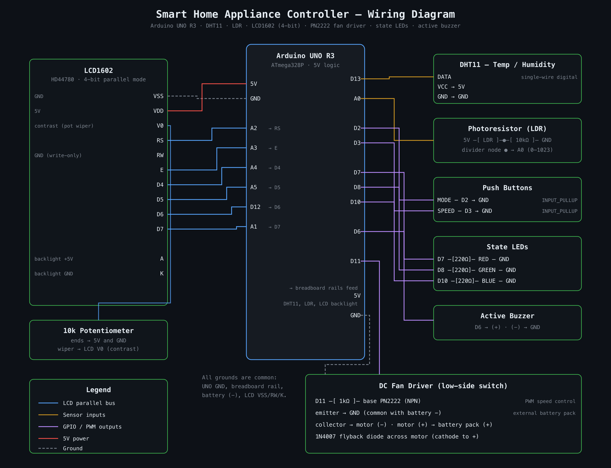

# Hardware Guide

Everything is built on a single 830-point breadboard around an Elegoo UNO R3
(Arduino UNO compatible, ATmega328P). This page is the component-level
reference; the visual version is
[`schematics/wiring-diagram.svg`](../schematics/wiring-diagram.svg)
(also available as [PNG](../schematics/wiring-diagram.png) and
[PDF](../schematics/wiring-diagram.pdf)).

## Bill of materials

| # | Component | Qty | Role |
|---|-----------|-----|------|
| 1 | Elegoo UNO R3 (ATmega328P) | 1 | main microcontroller, 5 V logic |
| 2 | 830-point breadboard | 1 | prototyping platform |
| 3 | DHT11 temperature/humidity sensor (breakout) | 1 | temperature + humidity input |
| 4 | Photoresistor (LDR) | 1 | ambient light input |
| 5 | LCD1602 (HD44780-compatible) | 1 | live readings + mode display |
| 6 | 10 kΩ potentiometer | 1 | LCD contrast (V0) |
| 7 | 5 mm LEDs — red, green, blue | 3 | mode/alarm indicators |
| 8 | Active buzzer | 1 | over-temperature alarm |
| 9 | Momentary push buttons | 2 | mode select + manual fan speed |
| 10 | Small DC fan motor | 1 | the controlled appliance |
| 11 | PN2222 NPN transistor | 1 | low-side fan driver |
| 12 | 1N4007 diode | 1 | flyback protection across the motor |
| 13 | Battery pack for the fan motor | 1 | motor supply (separate from USB 5 V) |
| 14 | 10 kΩ resistor | 1 | LDR divider lower leg |
| 15 | 1 kΩ resistor | 1 | transistor base resistor |
| 16 | 220 Ω resistors | 3 | LED current limiting |
| 17 | Jumper wires | — | point-to-point wiring |

## Pin map

| Arduino pin | Connection | Direction | Notes |
|-------------|------------|-----------|-------|
| D2  | Mode button → GND | in | `INPUT_PULLUP`, polled with 20 ms debounce |
| D3  | Speed button → GND | in | `INPUT_PULLUP`, active only in MANUAL |
| D6  | Active buzzer (+) | out | alarm on/off |
| D7  | Red LED via 220 Ω | out | ALARM indicator |
| D8  | Green LED via 220 Ω | out | AUTO indicator |
| D10 | Blue LED via 220 Ω | out (PWM) | MANUAL indicator / SLEEP nightlight |
| D11 | 1 kΩ → PN2222 base | out (PWM) | fan speed |
| D12 | LCD D6 | out | part of the 4-bit data bus |
| D13 | DHT11 DATA | in/out | single-wire protocol |
| A0  | LDR divider node | in (ADC) | 0–1023 |
| A1  | LCD D7 | out | |
| A2  | LCD RS | out | |
| A3  | LCD E  | out | |
| A4  | LCD D4 | out | |
| A5  | LCD D5 | out | |

## Subsystem notes

### LCD1602 (4-bit parallel)

Driven by the stock `LiquidCrystal` library with
`LiquidCrystal lcd(A2, A3, A4, A5, 12, A1)`. Because the 6-argument
constructor is used, **RW is hardwired to GND** (write-only). VSS → GND,
VDD → 5 V, backlight A → 5 V and K → GND. Contrast pin V0 is fed from the
wiper of the 10 kΩ potentiometer (ends on 5 V and GND) — if the display
powers up but shows nothing, turn this pot first.

### Fan driver

The motor is **not** powered from the Arduino: a separate battery pack
supplies the motor, and the PN2222 switches the low side at the PWM rate
from D11 (through the 1 kΩ base resistor). The 1N4007 sits across the motor
terminals (cathode toward battery +) to clamp the inductive kick at turn-off.
Battery (−) ties into the common ground rail — without that shared ground
the transistor never switches.

### Sensors

- **DHT11** breakout on D13: VCC → 5 V, GND → GND, one digital data line.
  The main loop's 2 s delay doubles as the sensor's minimum sampling
  interval.
- **LDR**: classic divider — 5 V → LDR → node → 10 kΩ → GND, node into A0.
  More light = higher reading. Thresholds in the sketch classify
  Dark / Dim / Light / Bright / Very Bright.

### Assumptions (verify before rewiring from scratch)

These details were reconstructed from the code, build photos, and the
original notes rather than a formal schematic:

- The LCD backlight anode appears to be wired directly to 5 V in the photos;
  many LCD1602 modules have an on-board backlight resistor. If yours does
  not, add ~220 Ω in series.
- The fan battery pack's voltage isn't recorded; it appears to be a 2xAA
  holder in the photos. Match it to your motor's rating.
- The original parts list called the indicators an "RGB LED", but the photos
  show three discrete 5 mm LEDs (red, green, blue), which is also what the
  sketch drives. The wiring diagram follows the photos.
